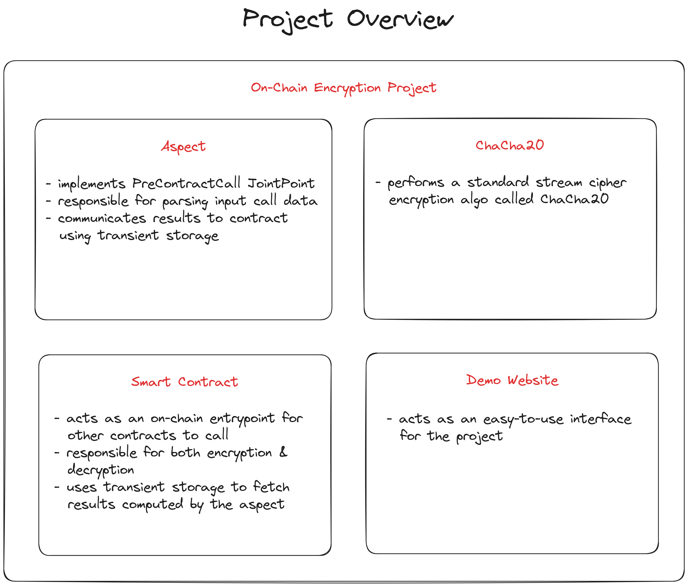
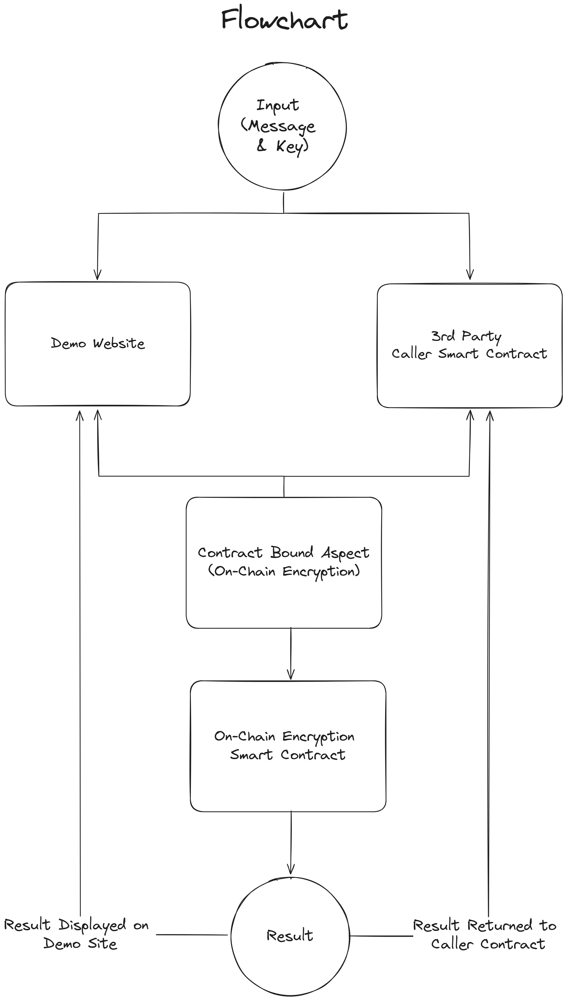
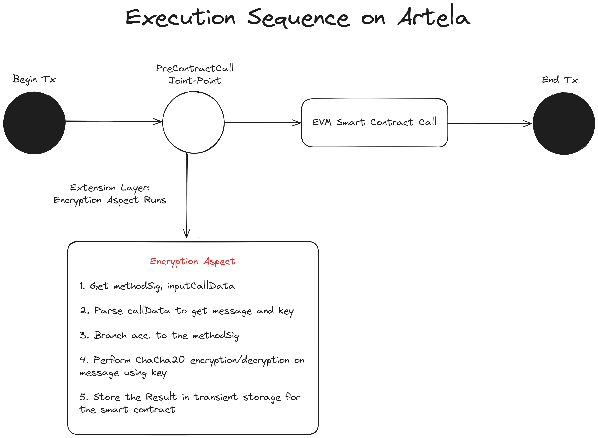
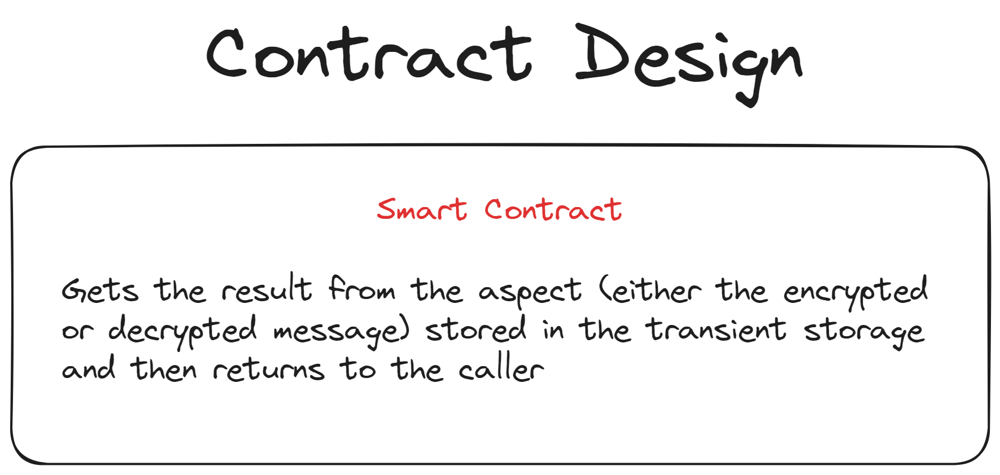

#  On-Chain Data Encryption

  

> Using _ChaCha20-Poly1305_ to encrypt data on-chain

  

##  Use Case Summary

  

**On Chain Data Encryption** is a project that aims to provide a solution to the problem of data encryption on the blockchain. The project uses the _ChaCha20-Poly1305_ algorithm to encrypt data on-chain, allowing users to encrypt and decrypt data on-chain. Such a solution can be used in various scenarios, such as the encryption of private keys, passwords, and other sensitive data on the go in a decentralized manner on the smart contracts themself.

  

**With On-Chain Data Encryption, you can enable following features for your dApp:**

  

-  **Encryption of sensitive data:** Users can encrypt sensitive data such as private keys, passwords, and other sensitive data on the go in a decentralized manner on the smart contracts themself.

-  **Native Speed:** The _ChaCha20-Poly1305_ algorithm is implemented in native assembly, which is faster than any other on-chain alternative. This eliminates the need for off-chain encryption and decryption in most of the cases.

-  **Easy to use:** The project provides a simple interface for encryption and decryption of data on-chain, making it easy to use for developers. This provided 2 points of contact for developers to use the project in their dApps.

- Deploy Encryption Contract: Developers can call the methods of this contract to encrypt and decrypt data on-chain.

- Use Encryption Aspect: Developers can use the encryption aspect to encrypt and decrypt data on-chain.

  

##  Team Members and Roles

  

Team Member 1: [Suryansh Chauhan](https://twitter.com/SuriPuri23)

Team Member 2: [Rudransh Shinghal](https://twitter.com/rudransh190204)

  

##  Problem Addressed

  

The idea of **On-Chain Data Encryption** aims to address the challenge of ensuring data security and confidentiality on the blockchain. As data on the blockchain is publicly accessible, there is a need to prevent unauthorized access to sensitive information. The project proposes the use of the _ChaCha20-Poly1305_ algorithm to encrypt data on-chain, enabling users to encrypt and decrypt data in a decentralized manner. This solution is essential for safeguarding private keys, passwords, and other sensitive data stored and utilized within smart contracts.

  

The need for on-chain data encryption arises due to the inherent security risks associated with off-chain encryption. Off-chain encryption requires the management of keys outside the blockchain, which can be vulnerable to compromise.

  

For example, when a healthcare provider needs to access a patient's record, they can do so by decrypting the data on-chain, ensuring the confidentiality and security of the patient's information.

  

##  Project Design

  

###  System Overview

  

####  1. Project Overview

  



  

<!-- Additional info:

  

- `Specific contract` is a contract address. For example, if it’s a DEX contract address, it means that the session key is only limited to calling an Artex contract.

  

- `Specific methods` is a list of method signature of `Specific contract`. For example, if it’s `[0x0000CAFE, 0xCAFE0000,]` , it means that the session key is only limited to this two method. -->

  

####  2. Flowchart

  



  

<!-- Additional info :

  

- The `from` is still the address of EoA.

  

- The signature `v,r,s` is generated by private key of sKey. -->

  

####  3. Execution Sequence

  



  

<!-- Additional info

  

- The transaction may be signed by the EoA privaten point needs to be verified by the EoA public key again if the Aspect returns key, so the joi false. -->

  

####  4. Contract Design

  



  

<!-- Additional info

  

- Smart contract doesn’t know which keys sign the tx.

  

- When the smart contract accesses `msg.sender` , the value is `from` in the transaction. -->

  

##  Implementation

  

Session-key Aspect project contains three components:

  

###  Client Implementation

-  **Client**, `client`, a client for the dApp front end that uses next along with wagmi & wallet connect integration.

-  **Aspect**, wasm bytecode deployed on Artela

###  Why we chose _ChaCha20-Poly1305_?

  

_ChaCha20-Poly1305_ is a symmetric encryption algorithm that is used to encrypt and decrypt data. It is a stream cipher that uses a 256-bit key and a 96-bit nonce. The ChaCha20-Poly1305 algorithm is a fast and secure encryption algorithm that is used in many applications, including TLS and SSH.

  

The decision to use the _ChaCha20_ encryption algorithm for the "On-Chain Data Encryption" project is based on several compelling reasons:

  

- Performance: _ChaCha20-Poly1305_ is known for its exceptional performance, especially on mobile devices. It is approximately three times faster than AES-128-GCM on such devices, leading to lower gas fees when computing on-chain. Additionally, the _ChaCha20-Poly1305_ algorithm is implemented in native assembly, which is faster than any other on-chain alternative.

  

- Security: The _ChaCha20-Poly1305_ construction is proven to be secure in the standard model. It offers similar levels of security to AES and is less prone to attacks, making it a robust choice for on-chain data encryption.

  

###  Value to the Artela Ecosystem

  

The "On Chain Data Encryption" project provides significant value to the Artela ecosystem in several ways:

  

-  **Enhanced Security**: The project's on-chain data encryption solution enhances the security of the Artela blockchain network by encrypting sensitive data directly on the blockchain.

-  **Improved Functionality**: The project's solution enables developers to build more feature-rich dApps on the Artela network. By providing a secure and decentralized way to encrypt data on-chain, developers can create more sophisticated applications that require secure data storage and management.

-  **Integration**: The project's solution can be easily integrated into existing dApps on the Artela network, allowing developers to add encryption functionality to their applications without having to rewrite their code, adjusting for off-chain mechanisms.

-  **Potential for Widespread Adoption**: The project's use of the widely supported ChaCha20-Poly1305 algorithm for on-chain data encryption has the potential for widespread adoption, attracting more developers and users to the Artela ecosystem.

  

###  How to Use
  

####  Contract usage 
below is an example, when a healthcare provider needs to access a patient’s record, they can do so by decrypting the data on-chain, ensuring the confidentiality and security of the patient’s information
```solidity

// SPDX-License-Identifier: GPL-3.0
pragma solidity >=0.8.0 <0.9.0;

/**
 * @title HealthDataStorage
 * @dev Smart contract for storing health data with encryption and decryption
 */
contract HealthDataStorage {
    // Address of the deployer
    address private deployer;

    // Encryption contract instance
    Encryption private encryptionContract;

    // Mapping to store encrypted health data
    mapping(address => string) private encryptedHealthData;

    // Event for tracking changes in health data
    event HealthDataUpdated(address indexed user, string encryptedData);

    constructor(address _encryptionContract) {
        deployer = msg.sender;
        encryptionContract = Encryption(_encryptionContract);
    }

    modifier onlyOwner() {
        require(msg.sender == deployer, "Not the owner");
        _;
    }

    // Function to check if the caller is the owner
    function isOwner() external view returns (bool) {
        return encryptionContract.isOwner(msg.sender);
    }

    // Function to encrypt and store health data
    function encryptAndStoreData(string memory message, string memory key) external onlyOwner {
        string memory encryptedMessage = encryptionContract.encrypt(address(this), message, key);
        encryptedHealthData[msg.sender] = encryptedMessage;
        emit HealthDataUpdated(msg.sender, encryptedMessage);
    }

    // Function to get the decrypted health data
    function getDecryptedData(string memory key) external view returns (string memory) {
        string memory encryptedData = encryptedHealthData[msg.sender];
        return encryptionContract.decrypt(address(this), encryptedData, key);
    }
}

```


## How To setup the project

### 1. Project Setup
Clone the repository from https://github.com/Suryansh-23/artela-encryption-aspect.git

```bash
$ git clone https://github.com/Suryansh-23/artela-encryption-aspect.git
```

### 2. First create an EoA

```bash
$ npm run account:create
address:  0x6B70B03B608a19Bf1817848A4C8FFF844f0Be0fB
```
Store the private key of the EOA in `build/privateKey.txt`.

### 3. Initializing Environment Variables
```bash
$ CAddr=""
$ CAddr="0xbdE72CF308314fF3f8410AEF582b195FD64e2221"  # use this if you don't want to deploy the contract yourself

$ AAddr=""
$ AAddr="0x150A22c581a2B4BeDfEfEEC25C43519e593EF2E0"  # use this if you don't want to deploy the aspect yourself
```

### 4. Compile & Deploy the Contract
If you are going to use the deployed contract, you can skip this step.

```bash
$ npm run contract:build

$ npm run contract:deploy --  --abi ./build/contract/Encryption.abi --bytecode ./build/contract/Encryption.bin

$ CAddr="<Contract Address From Deploy>"
```

### 5. Compile, Deploy & Bind the Aspect
If you want to use the deployed aspect, you can skip this step.

```bash
$ npm run aspect:build

$ npm run aspect:deploy -- --wasm ./build/release.wasm --joinPoints PreContractCall

$ AAddr="<Aspect Address from Deploy>"

$ npm run contract:bind -- --contract $CAddr --abi ./build/contract/Encryption.abi --aspectId $AAddr
```

To verify the success of the bind process of the aspect on the contract run the following command.

```bash
$ npm run bound:aspect  -- --contract $CAddr --gas 200000
```

### 6. Calling the Contract & Other Info
The arguments for the contract are of the form - 
| AspectId (AAddr) | Message (hex of any length without 0x prefix) | Key (hex of 44 bytes or 88 chars without 0x prefix) |
|--------------|:-----:|-----------:|
| `0x150A22c581a2B4BeDfEfEEC25C43519e593EF2E0` | `48656c6c6f2c20576f726c6421` | `e2796a262d7726eaab439be0ce55209d92b9c3b49dc5337e0320bd8ee43f86aa79206238b9c815543eda8cb7` |

```bash
$ npm run contract:call -- --contract $CAddr --abi ./build/contract/Encryption.abi --method encrypt --args $AAddr --args 48656c6c6f2c20576f726c6421 --args e2796a262d7726eaab439be0ce55209d92b9c3b49dc5337e0320bd8ee43f86aa79206238b9c815543eda8cb7
```


## Folders 

- Folder [aspect](aspect/index.ts) implements the On-Chain Encryption Aspect;

- Folder [client](client/) implements the Aspect Demo using a Next.js client.
